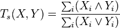

# Tanimoto in PyOpenCL

This program calculates the Tanimoto similarity of binary strings using [OpenCL](https://www.khronos.org/opencl/) through [Python](https://www.python.org) and [PyOpenCL](http://mathema.tician.de/software/pyopencl/). This implementation is designed to be simple and high-throughput for large inputs.

## Tanimoto Similarity

[Tanimoto similarity](http://en.wikipedia.org/wiki/Jaccard_index#Tanimoto.27s_definitions_of_similarity_and_distance) (aka. Tanimoto distance or Tanimoto index) is a way to measure the similarity between two binary strings where a 1 indicates the presence of a characteristic and a 0 indicates its absence. It is calculated as:

